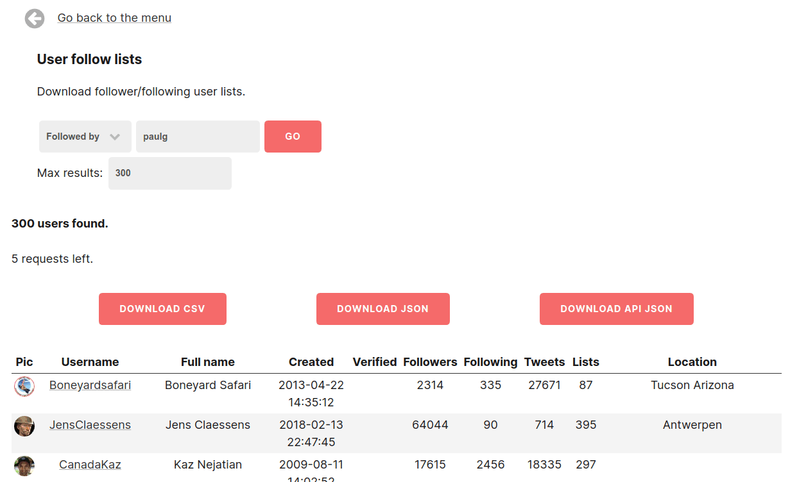

[tweetfeast.com](https://tweetfeast.com) was a short-lived micro-SaaS built on the Twitter API with full-stack ClojureScript.

Unfortunately Twitter revoked the API keys and suspended the account.
I decided to open source this repo so it might be a useful reference to others.

Enjoy!

